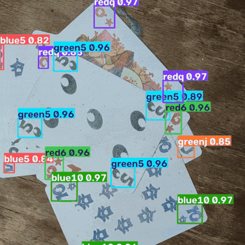

# Tichu Card Detection

Computer-vision pipeline for detecting and classifying the 56 cards in a Tichu
deck.




- Models are trained on the [Tichu italian Edition ](https://www.uplay.it/it/gioco-da-tavolo-tichu.html)

## Repository Layout

```text
configs/
  classes.names            existing ordered class names
  classes.yaml             canonical class IDs
  label_studio/            card-corner labeling configuration

data/
  raw/
    card_scans/             original scan videos
    card_videos/            original recordings
  external/dtd/             third-party texture images
  interim/                  extracted media, card crops, and caches
  synthetic/                color, mixed, and monochrome scene datasets

scripts/                    existing conversion and generation scripts
notebooks/                  existing exploration and training notebooks
models/pretrained/          generic YOLO initialization weights
models/trained/             weights from the current training runs
reports/training_runs/      metrics and plots from the current training runs
artifacts/test/             existing generated test outputs
```

## Generating the training data
The dataset is generated from either card scans or individual card videos. Card Symbols are extracted, labeled, randomly overlapped and augmented in this [notebook](notebooks\creating_playing_cards_dataset.ipynb).

## Annotation with Label Studio
Label Studio is used to manually annotate datasets. It is installed in a seperate python virtual environment. Datasets can be preannotated using one of the trained yolo models.

#### Install and launch
```powershell
python -m venv .venv-label-studio
.venv-label-studio/Scripts/activate

pip install -U label-studio
label-studio
```

#### Preannotating with a YOLO model
```powershell
$env:LABEL_STUDIO_LOCAL_FILES_SERVING_ENABLED = "true"
$env:LABEL_STUDIO_LOCAL_FILES_DOCUMENT_ROOT = (Resolve-Path "data/raw").Path

python scripts/preannotate_label_studio.py `
  --images "data/raw/<session_id>/images" `
  --weights "models/trained/<run>/weights/best.pt" `
  --output "data/annotations/label_studio/<session_id>/yolo-predictions.json"

$env:LABEL_STUDIO_LOCAL_FILES_SERVING_ENABLED = "true"
label-studio
```

## Benchmarks
Benchmarks are run from this [Notebook](notebooks/benchmark_models.ipynb).


#### Benchmark 1
Four yolov10m models were trained with the same synthetic dataset and benchmarked on a manually annotated (preanotated by model) [dataset](data/raw/20260728T210000_poco-f3/).


|  # | Model           | Precision (B) | Recall (B) | mAP50 (B) | mAP50–95 (B) |
| -: | --------------- | ------------: | ---------: | --------: | -----------: |
|  0 | color           |      0.912686 |   0.850112 |  0.899588 |     0.853612 |
|  1 | color_finetuned |      0.923315 |   0.804554 |  0.878335 |     0.823419 |
|  2 | mixed           |      0.899029 |   0.869885 |  0.906991 |     0.888634 |
|  3 | monochrome      |      0.847741 |   0.724981 |  0.829099 |     0.778361 |
